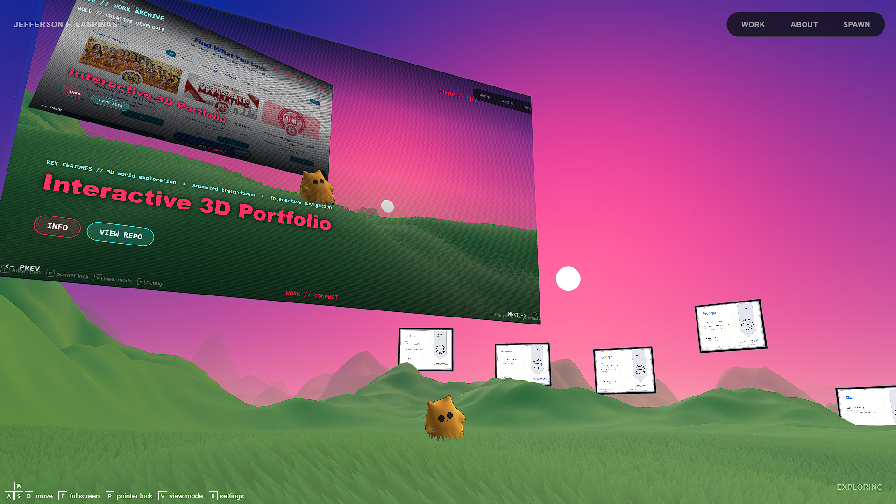

# 🎮 Jeff Portfolio

**An interactive 3D portfolio you explore, not just scroll.**

Built on top of Bruno Simon's *Infinite World* concept and extended into a full personal portfolio — walk a controllable character through a procedurally generated world where projects, resume, and achievements live as objects in the environment itself.

[**🌐 Live Portfolio**](https://field-notes-xi-eight.vercel.app/) · [**📦 Repository**](https://github.com/ionlyknows/ionlyknows.github.io) · [**💻 GitHub Profile**](https://github.com/ionlyknows)



---

## 🧭 About the Portfolio

Instead of a traditional scrolling website, this portfolio is a small 3D world you move through with a controllable character. Project showcases, an "About Me" hub, resume details, activities, and achievement certificates are all placed as interactive elements inside that world — floating billboards, teleporters, and panels — rather than separate static pages.

The goal is to make browsing a portfolio feel like *exploring*, while still surfacing the same information a recruiter or visitor would expect from a conventional site.

## ✨ Features

- 🌍 **Interactive 3D world** — a procedurally generated terrain you can freely explore
- 🕹️ **Controllable character** — move around the world with keyboard controls (`WASD`)
- 📋 **Floating project billboard** — projects are displayed on an in-world billboard
- 🔁 **Automatic project showcase** — projects cycle/rotate for discovery
- 🧭 **Project navigation** — move between showcased projects directly in the world
- 👤 **About Me interface** — bio, skills, and quick-info panel
- 📄 **Resume interface** — dedicated resume panel
- 🗂️ **Activities section** — organizational and campus activity highlights
- 🏆 **Achievement / certificate billboards** — certificates displayed as in-world billboards
- 🖼️ **Interactive certificate viewing** — inspect certificates up close
- 📱 **Responsive / mobile-aware experience** — mobile notice for the best interaction mode
- 🎞️ **GSAP-powered animations** — smooth UI and in-world transitions
- 🎨 **WebGL rendering** — real-time 3D graphics via Three.js
- 🌲 **Custom Three.js environment** — terrain, sky, water, grass, and flowers built from scratch

## 🗺️ Portfolio Sections

| Section | Description |
|---|---|
| **Work** | Interactive project showcase — browse featured and past projects in the 3D world |
| **About** | Biography, education, skills, and contact info |
| **Resume** | Professional / resume-focused information |
| **Activities** | Organizational involvement and campus/community activities |
| **Achievements** | Certificates and credentials, shown as viewable in-world billboards |

## 🛠️ Technology Stack

| Category | Technology |
|---|---|
| 3D Engine | [Three.js](https://threejs.org/) |
| Rendering | WebGL |
| UI Framework | [Vue.js 3](https://vuejs.org/) |
| Animation | [GSAP](https://gsap.com/) |
| Build Tool | [Vite](https://vitejs.dev/) |
| Language | JavaScript (ES Modules) |
| Markup / Styling | HTML5, CSS3 |
| Shaders | GLSL (via `vite-plugin-glsl`) |
| Noise / Terrain Generation | `simplex-noise`, `seedrandom` |
| Utility | `gl-matrix`, `stats.js`, `lil-gui`, `events` |

## 📁 Project Structure

```
Yknowjeff.github.io/
├── index.html                 # App entry point & in-world control hints
├── vite.config.js             # Vite build configuration
├── public/                    # Static assets served as-is
│   ├── 3D.png                 # Portfolio screenshot (used above)
│   ├── avatar.jpg             # About Me avatar
│   ├── certificates/          # Achievement certificate images
│   ├── projects/              # Project showcase images
│   └── social/                # Open Graph / share preview images
└── sources/
    ├── index.js                # App bootstrap
    ├── style.css                # Global styles
    ├── Game/                    # Three.js game/world layer
    │   ├── State/                # Game state (player, camera, terrain, controls, time...)
    │   ├── View/                 # Rendering layer (terrain, billboards, sky, water, player model...)
    │   ├── Debug/                 # Debug tooling
    │   └── Workers/               # Web workers (e.g. terrain generation)
    └── UI/                       # Vue-based interface layer
        ├── App.vue                # UI root
        ├── UIBridge.js             # Bridge between the 3D world and Vue UI
        ├── components/              # Navigation, HUD, billboard viewer, panels
        │   └── panels/                # About / Resume / Work info panels
        ├── composables/              # Vue composables (game hook, escape handling, UI bridge)
        └── data/                     # About & project content data
```

## 🧱 HTML5 / CSS3 & Responsive Implementation

This portfolio renders as a single-page WebGL/Vue application, so most of the HTML5/CSS3 work isn't in the root `index.html` shell — it lives inside the Vue components that make up the UI layer. For anyone reviewing the implementation directly:

| Technique | Where to find it |
|---|---|
| Semantic markup (`<nav>`, `aria-*` attributes) | `sources/UI/components/Navigation.vue`, panel components under `sources/UI/components/panels/` |
| CSS Grid | `WorkInfoPanel.vue`, `AboutPanel.vue`, `SettingsPanel.vue`, `LoadingScreen.vue` |
| CSS Flexbox | `sources/style.css`, `Navigation.vue`, and every panel component |
| Responsive `@media` breakpoints | `sources/style.css`, `Navigation.vue`, `BillboardViewer.vue`, `CertificateHint.vue`, `WorkInfoPanel.vue`, `AboutPanel.vue`, `SettingsPanel.vue` |
| CSS custom properties / design tokens | `sources/UI/styles/tokens.css` |

The root `index.html` stays intentionally minimal — it only bootstraps the canvas and the movement-key hint overlay — because the interactive UI (navigation, panels, billboards) is mounted into it at runtime by Vue.

## 🚀 Running Locally

```powershell
git clone https://github.com/ionlyknows/ionlyknows.github.io.git
cd ionlyknows.github.io

npm install

npm run dev
```

## 🏗️ Build / Production

```powershell
npm run build
```

This outputs a production-ready build to the `dist/` folder.

## 🚢 Deployment

The primary live deployment is on **Vercel**: [field-notes-xi-eight.vercel.app](https://field-notes-xi-eight.vercel.app/) — this is the link shared on my resume and profiles.

A secondary mirror auto-deploys to **GitHub Pages** on every push to `main` via GitHub Actions ([workflow](.github/workflows/deploy.yml)): [ionlyknows.github.io](https://ionlyknows.github.io/).

## 🙏 Credits / Inspiration

- Built on the concept and foundation of [**Infinite World**](https://github.com/brunosimon/infinite-world) by [Bruno Simon](https://bruno-simon.com/), an infinite procedurally generated world built with Three.js.
- Extended and customized with an original portfolio UI, project/resume/activities/achievements content, and interaction design specific to this project.

## 👤 Author

**Jefferson F. Laspiñas**
Computer Science student

- 🌐 Portfolio: [Jeff Portfolio](https://field-notes-xi-eight.vercel.app/)
- 💻 GitHub: [@ionlyknows](https://github.com/ionlyknows)